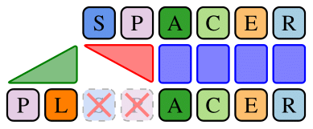
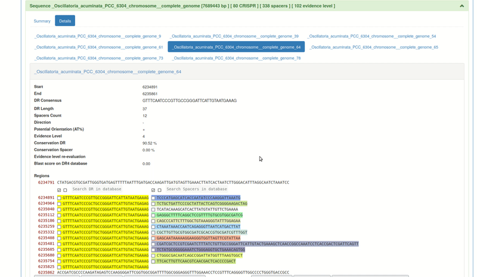

# SpacerPlacer




SpacerPlacer is a powerful software for reconstructing ancestral CRISPR spacer arrays along a given phylogenetic tree.
SpacerPlacer is respecting the chronological timeline of spacer insertions as defined by the order of spacers within the CRISPR arrays and uses this additional information to improve the ancestral reconstruction.
   

## Features

- **Ancestral Spacer Array Reconstruction:** SpacerPlacer allows you to reconstruct ancestral CRISPR spacer arrays based on a given phylogenetic tree.
- **Identification of Ancestral Spacer Acquisitions, Deletions, Duplications, and Rearrangements:** The tool identifies ancestral duplications and rearrangements within the CRISPR array.
- **Spacer Deletion Rate Estimation:** The software provides an estimation of spacer deletion rates within the CRISPR arrays.
- **Analysis of Jointly Lost Spacers:** SpacerPlacer calculates the average length of blocks of jointly lost spacers in the array.
- **Optional: Phylogenetic Tree Reconstruction:** In addition to spacer array reconstruction along a given tree, SpacerPlacer can also reconstruct phylogenetic trees based on the CRISPR spacer data.


## Corresponding Paper & Conference Poster
The corresponding paper to SpacerPlacer is now published in Nucleic Acids Research: [SpacerPlacer: Ancestral reconstruction of CRISPR arrays reveals the evolutionary dynamics of spacer deletions](https://doi.org/10.1093/nar/gkae772).
Please cite it, if you use SpacerPlacer in your work. The citation is:
```
Axel Fehrenbach, Alexander Mitrofanov, Omer S Alkhnbashi, Rolf Backofen, and Franz
Baumdicker. SpacerPlacer: ancestral reconstruction of CRISPR arrays reveals the
evolutionary dynamics of spacer deletions. Nucleic Acids Research, gkae772, 2024. doi:
10.1093/nar/gkae772.
```

The paper is also available on bioRxiv: [SpacerPlacer: Ancestral reconstruction of CRISPR arrays reveals the evolutionary dynamics of spacer deletions](https://www.biorxiv.org/content/10.1101/2024.02.20.581079v2).

We presented a poster at the conference CRISPR2023, showcasing the features and applications of SpacerPlacer: [SpacerPlacer Poster](doc/posters/crispr2023_spacerplacer.pdf).

[//]: # ( and the related CRISPR-evo-inator tool to predict the direction of transcription of CRISPR arrays)


[//]: # (- [CRISPR-evo-inator Poster]&#40;doc/posters/crispr2023_CRISPRevoinator.pdf&#41;)

Please feel free to explore the paper/poster to learn more about SpacerPlacer and its applications.


[//]: # (## Code Availability)

[//]: # ()
[//]: # (We are currently in the process of preparing the code for SpacerPlacer and will soon be adding it to this repository. We appreciate your patience!)

[//]: # ()
[//]: # (To stay up to date with the latest developments, we recommend bookmarking this repository and checking back periodically for updates.)

[//]: # ()
[//]: # (Alternatively, you can reach out to us via email at axel.fehrenbach@uni-tuebingen.de to express your interest in SpacerPlacer. We will be happy to notify you once the code becomes available.)

[//]: # ()
[//]: # (Thank you for your interest in SpacerPlacer!)

[//]: # ()
[//]: # ()
[//]: # (However, if you want to already prepare your input data here is what SpacerPlacer requires as an input:)

[//]: # ()

## Installation and Usage
Install SpacerPlacer either by cloning the GitHub repository or by using Bioconda.
The version on Bioconda is the latest release version on github and may lag behind the main branch in the github repository.


At the moment, SpacerPlacer is supported on Linux. Although we try to make it work on other operating systems, 
we do not guarantee that it will work. If you encounter issues, please let us know.

### Installation via Bioconda
SpacerPlacer is now available on Bioconda. Follow the instructions below to install it:

1. [Install conda](https://docs.conda.io/projects/conda/en/latest/user-guide/install/index.html), if you haven't already.
2. Set up Bioconda channels (https://bioconda.github.io/), if you haven't already:
   ```bash
   conda config --add channels defaults
   conda config --add channels bioconda
   conda config --add channels conda-forge
   ```
3. Create a new conda environment with spacerplacer:
   ```bash
   conda create -n <myenv> spacerplacer
   ```
   or install it in an existing environment:
   ```bash
    conda install spacerplacer
    ```
   and activate the environment:
   ```bash
    conda activate <myenv>
    ```


### Installation via GitHub Repository
Follow the instructions below to install SpacerPlacer from the GitHub repository:

1. Clone the GitHub repository:

   ```bash
   git clone https://github.com/fbaumdicker/SpacerPlacer.git
   ```
 
2. We recommend to use conda, 
as mafft is easily installed using conda (otherwise it needs to be manually installed). [Install conda](https://docs.conda.io/projects/conda/en/latest/user-guide/install/index.html), if you haven't already.

3. Navigate to the cloned repository and install the required packages in a new environment:

   ```bash
    cd SpacerPlacer
    conda env create -n <myenv> -f environment/environment.yml
   ```
   With -n <myenv> you can name the environment. You can choose any name you like or leave it out, as environment.yml provides a default name (spacerplacer_env).

4. Activate the environment:

   ```bash
   conda activate <myenv>
   ```

### Usage
If you installed SpacerPlacer via Bioconda, you can run it directly from the command line regardless of the installation path:
```bash
   spacerplacer <input_path> <output_path> [options]
```

If you installed it via the Github repository, you can run SpacerPlacer with (in the cloned repository):

   ```bash
   python spacerplacer.py <input_path> <output_path> [options]
   ```
"input_path" is a required positional argument. It specifies the input directory containing the input data. For the required format see the respective section.
"output_path" is a required positional argument. It specifies the output directory where the results will be saved.


***If you use the Bioconda installation replace "python spacerplacer.py" with "spacerplacer" in all following commands.***

Available options can be found by running:

   ```bash
   python spacerplacer.py -h
   ```

You can also provide the options in a config file. Then you can run SpacerPlacer with the following command:

   ```bash
   python spacerplacer.py @<config_file_path>
   ```

We provide example configs in the "configs" directory. You can use them as a template for your own config file and run
them in SpacerPlacer as described above, e.g.:

   ```bash
   python spacerplacer.py @configs/config_workflow_example_listeria_monocytogenes
   ```
"@" specifies that the following argument is the path to a config file.
The example configs use example data found in "example_data" directory. 
If you cloned the repository, you may run them to see if everything works as expected and to get an idea about the output 
and how you would like to structure your input.

## CRISPR orientation prediction
SpacerPlacer allows to predict the insertion orientation of CRISPR arrays and thus, indirectly, the 
transcription orientation and the leader end.
Currently, the transcription orientation can be predicted within SpacerPlacer using the option 
"--determine_orientation".

If run with this option, SpacerPlacer will predict the orientation of the CRISPR arrays by running the reconstruction 
of the given CRISPR arrays in the given (forward) orientation and by reversing the arrays and running the 
reconstruction again. These two reconstructions are then compared. 
If the difference in likelihoods between the forward and reverse reconstructions exceeds a threshold, 
which can be provided by the user with "--orientation_threshold <threshold>", 
SpacerPlacer will predict the orientation accordingly. (the likelihoods + ratio are returned as well so you can do your own 
analysis).
This orientation is then used for reporting details about the reconstruction and parameter estimates 
in the summary and result files.

Note, that the orientation predictions only impacts the "0_results.csv" and the "0_forward" and "0_reversed" folders 
refer to the provided orientation.
As described in the section "Output" section, all information for reconstructions with both orientations is accessible 
in the respective directories.
If the difference in likelihoods is below the threshold, SpacerPlacer will use the forward/provided orientation as 
default.

## Input data
The CRISPR array input data has to be provided in a specific format. We provide three alternative input formats:
"spacer_fasta", "ccf_json/crisprcasfinder_json" and "ccdb/crisprcasdb". Trees can be estimated by SpacerPlacer 
based on the spacer arrays, but we generally recommend to provide trees, if available, in particular, to get interpretable results 
in parameter estimates.
The following sections describe the input formats in detail.
IMPORTANT: the input type should be specified using the option "-it" or "--input_type", default is "spacer_fasta".

SpacerPlacer can either run a single group or multiple groups of CRISPR arrays sequentially. 
Names are of course arbitrary and can be chosen freely. 
Each group should contain at least two arrays. If there is no overlap in spacers between the arrays,
the results of SpacerPlacer will be relatively boring.

### spacer_fasta input format
Note, that the group should be in a file with extensions ".fa", ".fasta", ".fna". Each fasta file contains the spacers of the 
corresponding arrays in the group structured as follows:
```
    >array_1
    3, 2, 1
    >array_2
    4, 2, 1, 7
    >array_3
    6, 5, 2, 2, 7
    ...
```
The first line after ">" is the identifier of the array or strain (arbitrary) and should be unique!
The numbers in the example are the spacer IDs and separated by ",", but can be any string 
(that does not include "," and/or " "). 
Each spacer ID corresponds to a unique spacer sequence (or a group of spacer sequences, 
if you want). Repeats are not part of this format.
The order of the spacers is important and should be the same for all arrays in the group.
We expect the spacers to be ordered chronologically, where the insertion end is on the left and the distal end on the 
right, i.e. the first (leftmost) spacer is the youngest,
while the last (rightmost) spacer is the oldest. 
Most importantly, the order of the spacers should be consistent for all arrays in the group.
Note, there is no need to provide reversed spacers, as SpacerPlacer will automatically reverse the spacers 
to run a reconstruction in reverse orientation (if the option is provided).

You may run a single group of CRISPR arrays in spacer_fasta format by running:
   ```bash
   python spacerplacer.py <spacer_fasta_path> <output_path> -it spacer_fasta [more_options]
   ```
or without specifying the input type, as "spacer_fasta" is the default.

If you want to run multiple groups subsequently in this format, the files should be structured as follows:
```bash
    .
    ├── experiment              # Top-level directory of run (the input directory provided to SpacerPlacer)
    │   ├── group_1.fa          # First group of CRISPR arrays
    │   ├── group_2.fa          # Second group of CRISPR arrays
    │   ├── group_3.fa          # Third group of CRISPR arrays
    │   └── ...                 # etc.
    └── ...                  
```

You can then run SpacerPlacer with the following command:

   ```bash
   python spacerplacer.py <input_path> <output_path> -it spacer_fasta [more_options]
   ```
or without specifying the input type, as "spacer_fasta" is the default. "input_path" is the top-level directory 
of the run, in this example "<path-to-experiment>/experiment".


### CRISPRCasFinder json input format
SpacerPlacer can work with the output of CRISPRCasFinder directly. Note that in this case, SpacerPlacer performs clustering 
steps to collect meaningful groups with spacer overlap out of the available CRISPR arrays detected by CRISPRFinder.

Place the output folder of your CRISPRCasFinder run
in the input directory (whatever path you choose). You can also only place the "result.json" in each folder as this is 
the only file used by SpacerPlacer. You can place multiple runs/folders in the input directory and the results 
from all directories will be combined and used.

The input directory should look something like this:
```bash
    .
    ├── input_path                # Top-level directory of run (the input directory provided to SpacerPlacer)
    │   ├── Result_ccf1_x         # First result folder from CRISPRCasFinder
    │   │   ├── result.json       # result.json file
    │   │   └── ...               # other files (not required)
    │   ├── Result_ccf2_y         # Second result folder from CRISPRCasFinder
    │   │   ├── result.json       # result.json file
    │   │   └── ...               # other files (not required)
    │   └── ...                   # etc.
    └── ...                  
```
To run SpacerPlacer with the (shown) CRISPRCasFinder output, you can use the following command:
   ```bash
   python spacerplacer.py <input_path> <output_path> -it ccf_json [more_options]
   ```

Spacerplacer then follows multiple (optional) steps to:
1. extract relevant CRISPR arrays from the result.json(s),
2. forms groups of array with the same consensus repeats, 
3. (optional) cluster spacers by levenshtein distance, 
4. group arrays together according to spacer overlap,
5. gives the clusters/spacers IDs (for visual clarity), 
6. converts each group into "spacer_fasta" format and
7. runs SpacerPlacer on all groups with two or more arrays.
All of these steps are explained in detail in the [paper](https://doi.org/10.1093/nar/gkae772).

Notes on the steps and some additional options available for the "ccf_json" input format:
1. Orientation of the arrays is determined by the CRISPRDirection prediciton of CRISPRCasFinder, options: `--min_evidence_level <level>: Minimum evidence level of CCF prediction (default: 4), 4 is the highest.` See CCF documentation for more info. 
   We generally recommend to use minimum evidence level 3 or 4 to avoid (very short) false positive CRISPR arrays.
2. Note, that all subsequent steps are run within each consensus repeat group.
3. This clusters spacers according to their edit distances to avoid missing overlap between arrays due to (single/few) mutations.
   Options: `--cluster_spacers: If given, cluster spacers by levenshtein distance (default: False); --cluster_spacers_max_distance <distance>: Determines maximum distance for spacers to be clustered (default: 1).`
   Each cluster chooses a representative spacer sequence, that replaces all spacers in the cluster for subsequent steps.
4. Groups are currently named simply as "g_<counter>".
5. The IDs are simply numbers that replace the (representative) spacer sequences of each array. 
   The IDs can be used to identify the spacers in the output files. Note that these IDs are sometimes called "spacer names" and not the same as the "spacer numbers" distributed by SpacerPlacer (for spacer uniqueness) during the reconstruction.
6. These files can then be used for subsequent reconstructions with SpacerPlacer; see section "spacer_fasta input format" above.

All groups are saved as spacer_fasta in the output folder and all steps save relevant information into fasta and json files; see section "Outputs" for more details.

This is designed for our own use and convenience, so it might not be perfect for your purposes. 
Thus, if this does not work well for you, we recommend to do your own clustering and preprocessing steps and use "spacer_fasta" input format.
However, if you ran into issues, or have ideas for improvements that might also be beneficial for others, please let us know.
We would love to hear your feedback.

### CRISPRCasdb input format
SpacerPlacer can use data in CRISPRCasdb output format.
To get files in this format you can e.g. extract existing arrays from CRISPRCasdb 
or submit the genomic sequences to the CRISPRCasFinder web server (and then extract them).


You then need to carefully select the output CRISPR array and place them into two folders as the 
CRISPRCasdb interface is capable of predicting the orientation but always provides the spacers in the forward 
strand orientation (and does not change their ordering). 
Be aware that since CRISPRCasFinder predicts the orientation internally the consensus repeat will appear different 
in the output.





CRISPRCasFinder only provides the forward strand orientation. So in order to ensure the correct representation 
you need to place all the files classified as forward strand into the "pos_strand" directory,
and all the files classified as reverse strand into the "neg_strand" directory. 
Important: SpacerPlacer automatically reverse complements the spacers in the "neg_strand" directory in the parsing step. 
There is need to download the reverse complement file (on CRISPRCasdb) or to reverse the spacers manually. SpacerPlacer 
also reverses the order of the arrays in "neg_strand" (since CRISPRCasFinder/db does not).


(Note: the folder names are different in the gifs. See above or in the examples for the correct folder names.)

The CRISPRCasFinder output is a set of files in fasta format containing only the spacers from the corresponding CRISPR arrays.

In this format each group of CRISPR arrays should be structured as follows:
```bash
    .
    ├── experiment                # Top-level directory of run (the input directory provided to SpacerPlacer)
    │   ├── group_1               # First group of CRISPR arrays
    │   │   ├── pos_strand        # Forward strand CRISPR arrays
    │   │   │   ├── array_1.fna   # First array
    │   │   │   └── ... 
    │   │   ├── neg_strand        # Reverse strand CRISPR arrays
    │   │   │   ├── array_2.fna   # Second array
    │   │   │   ├── array_3.fna   # Third array
    │   │   │   └── ... 
    │   ├── group_2               # Second group of CRISPR arrays
    │   │   ├── pos_strand        # Forward strand CRISPR arrays
    │   │   │   └── ...           #
    │   │   └── rev_strand        # Reverse strand CRISPR arrays
    │   │       └── ...           #
    │   └── ...                   # etc.
    └── ...                  
```
where the file extensions should be ".fa", ".fasta", ".fna". Note, that the positive and negative strand folders 
can be empty. The arrays names need to be unique.

If the complete DNA sequence is in the file, as might be the case when getting data from CRISPRCasdb, delete the 
complete DNA sequence and keep only the spacers.

Examples of the format are shown in "example_data/workflow_example_listeria_monocytogenes" and
"workflow_example_listeria_monocytogenes_all_strains".

Providing the arrays in the right orientation is critical, as spacers might not be recognized as the same, if the orientations are not consistent.
CRISPRCasFinder does not always provide an orientation prediction and in some cases the predicted orientation might be wrong. 
If you are not sure about the orientation, it might be helpful to put an array in both folders (with different names) 
and check the results. Then if only one of those arrays shows spacer overlap, you have a likely candidate for a 
consistent orientation.
If reconstructions show no overlap, you might want to check the orientation of the arrays again.

You can then run SpacerPlacer with the following command:

   ```bash
   python spacerplacer.py <input_path> <output_path> -it ccdb [more_options]
   ```
 "input_path" is the top-level directory 
of the run, in this case "path-to-experiment/experiment". Note, that currently you need to specify the top-level 
directory not an individual group directory (even if you are only running one group).

SpacerPlacer will automatically convert the CRISPRCasdb format into "spacer_fasta" format. The converted files will 
be saved in the output directory, with dictionaries detailing the renaming process. 
For more details see the section "Output".

SpacerPlacer can perform spacer clustering as described in the section "CRISPRCasFinder json input format" with options:
`--cluster_spacers` and `--cluster_spacers_max_distance`. 


### (optional) Tree input format
Trees can be provided by the user. The trees MUST be in newick format and rooted. 

Providing a (or more) the "ccf_json" input format is currently not supported and unlikely to work. 
If you want to provide a tree, we recommend to first run "ccf_json" for the grouping and clustering and then run the 
obtained groups in "spacer_fasta" input format with suitable individual (sub)trees for each group as described below.

If only a single fasta is run, the direct path to the tree can be provided using the option "--tree_path <path_to_tree>".

There are two ways to provide trees for multiple groups of CRISPR arrays. NOTE: in both cases the names of the trees
need to be the same as the group names.
1) The trees can be provided as separate files
containing the tree as string in newick format (the choice of extension is irrelevant). 
To avoid issues, keep the tree files in a separate directory of the fasta files (or together in a subdirectory).
The file names need to be the same as the group names, 
e.g.:
```bash
    .
    ├── experiment                  # top-level directory of run
    │   ├── group_1.fa              # First group of CRISPR arrays
    │   ├── group_2.fa              # Second group of CRISPR arrays
    │   ├── group_3.fa              # Third group of CRISPR arrays
    │   └── ...                     # etc.
    └── trees                       # optional directory containing the trees
        ├── group_1.tree             # Tree for the first group of CRISPR arrays
        ├── group_2.tree             # Tree for the second group of CRISPR arrays
        ├── group_3.tree             # Tree for the third group of CRISPR arrays
        └── ...                     # etc.
```

2) OR you can provide the trees in a dictionary in a json file providing for each group (string) a newick tree (as string), 
e.g.:
```json
{
    "group_1": "((array_1:0.1,array_2:0.1):0.1,array_3:0.2);",
    "group_2": "tree2 in nwk format",
    "group_3": "tree3 in nwk format"
}
```
The leafs of the trees MUST be named like the array names in the CRISPR array files. 
Inner nodes do not need to be named (then SpacerPlacer names them during the algorithm).

1) Then you can run SpacerPlacer by referencing to the folder containing the newick trees using the option 
"--tree_path <path_to_tree_folder>".
2) OR you can run SpacerPlacer by referencing to the json file (containing the trees for all experiments)
using the option "--tree_path <path-to-json>/<tree-file-name>.json".

An example for one tree in json format is given in 
"example_datasets/workflow_example_core_genome_tree" used in "configs/config_workflow_example_lm_wcgt".

SpacerPlacer will automatically save the input trees or predicted trees in the output directory (as a dictionary 
{group_name: tree in nwk}) in a json file.

Avoid putting the trees in the "experiment" directory, 
as SpacerPlacer might try to process them as "experiment" (and return an error). 

## Output
The output of SpacerPlacer is saved in the output directory provided by the user. The folder contains a "summary.txt", 
"0_results.csv", "0_logger.log", and folders "additional_data", "detailed_results", "0_forward", and "_reversed", if 
the option "--determine_orientation" is used.

### Summary
The "summary.txt" file contains a summary of the run. It contains information about the input data, the options used,
and predicted parameters for each group.

### log-file
The "0_logger.log" file contains a log of the run. It contains information about the run, warnings, and errors occurring 
during the run. The amount of information in the log file can be controlled by the user by adjusting using the option 
"--verbosity".

### Results
The most important results are saved in the "0_results.csv" file. Where each row corresponds to a group of CRISPR arrays. 
If "--determine orientation" is used, the parameter estimates are taken from the reconstruction with the 
predicted orientation by SpacerPlacer. 
If there is no certain orientation, the parameter estimates and information about the reconstruction are taken from the 
forward orientation.

For more detailed results see the protocol files in the "0_forward" or "detailed_results" folder. The "detailed_results" 
folder only exists, if the option "--determine_orientation" is used.
They contain additional information about the reconstructions, where detailed_results contains the information about the 
reconstruction with the by SpacerPlacer predicted orientation.
Note, that parameter estimation of trivial groups, "trivial" meaning without a single deletion, is not possible. Any 
predicted parameters for trivial groups are not reliable.
"0_protocol_skipped.csv" contains groups that were skipped 
by SpacerPlacer and the reason for it.

The "0_forward" folder contains all visualizations of the reconstructions with forward/provided array orientation. 
The visualizations of the reconstructions and partial spacer insertion order (PSIO)
graphs for each group (and the .dot files used for rendering the PSIO graphs with graphviz).
<group_name>_rec shows the 
final reconstruction after the refinement step, while <group_name>_guide_rec show the first guide reconstruction (that 
does not follow the PSIO).
Additionally, we provide more compact versions <group_name>_(guide)_rec_pooled_events.
There, insertion and (successive) deletion events at the same branch are pooled together for visibility (if there are of 
length more thann 3). Moreover, insertion events at the leaf branches are pooled together, 
the number of insertions is shown in parentheses. In the header of the alignment, the number of unique leaf 
spacers is shown in parentheses.

If the option "--determine_orientation" is used, the "0_reversed" folder contains the same information as the 
"0_forward" folder for the CRISPR groups reconstructed in reverse orientation.

### Additional data
The "additional_data" folder contains additional data, such as the input/predicted trees as a dictionary in a json file, 
the CRISPR arrays in SpacerPlacers internal format in a pickle file. The "work_folder" contains the temporary files 
generated for the alignment step with MAFFT. 
The "spacer_fasta" folder contains the converted spacer_fasta files, if the input was in CRISPRCasFinder format.
Then there is also a file "<group_name>_spacer_name_to_seq.fa" referencing each spacer name to the corresponding 
DNA sequence and the orientation of the spacer DNA sequence. Note, this naming is done 
automatically by SpacerPlacer when converting the CRISPRCasFinder format to the spacer_fasta format.

The folder always contains a dictionary in a json file "<group_name>_spacer_name_to_sp_number.json", 
detailing the renaming process from the given spacer name to 
the internal spacer number used by SpacerPlacer (this is the numbering shown in reconstruction and PSIO visualizations).

To reiterate the spacer data is converted/renamed as follows:
- DNA sequences to spacer IDs/names to generate spacer_fasta files and determine spacer overlap between arrays. 
This step is only done, if the input format is "ccdb" or "ccf_json". The conversion is found in 
"<group_name>_spacer_name_to_seq.fa". Note that if "ccf_json" input format is used, additional (spacer) clustering steps are taken.
- Spacer IDs/names are converted to spacer numbers to run the reconstruction algorithm. 
This is done to guarantee that spacers numbers are unique during the algorithm. Note, that any additions to the 
spacer name (A, B, C, ...) show duplicate candidates in the Multiple Spacer Array Alignment. Each of those spacers have the 
same underlying DNA sequence (e.g. 9A, 9B are the same original spacer 9). 
This step is done for all input formats. The conversion is found in "<group_name>_spacer_name_to_sp_number.json".
The spacer numbers are the numbers shown in the reconstruction and PSIO visualizations as colored rectangles. 
The spacer IDs/names (with duplicate candidates), are shown in gray as column headings in the Multiple Spacer Array Alignment in the
visualized reconstructions. Thus, the information found in "<group_name>_spacer_name_to_sp_number.json" is also 
contained in any visualized reconstruction in the alignment headers.

#### Additional output for ccf_json input format

If the input format is "ccf_json", the output folder contains additional files:
- ccf_json_clustered_groups contains the clustered groups in "spacer_fasta" format that were large enough (more than 2 arrays) to be run through SpacerPlacer.
- ccf_json_too_small_clustered_groups contains the clustered groups in json format that were too small to be run through SpacerPlacer, i.e. they contain only one array.
- ccf_json_clustered_spacers contains for each group a json with the dictionary assigning clusters/spacers to spacer id (spacer name). 
Furthermore, it contains spacer_clusters.json which contains a dictionary of all spacer clusters pointing from their representative to a list of all members of the cluster for each repeat cluster.
- (Coming soon) More convenient way to track spacer sequences through SpacerPlacer and clustering process.

### Known issues, solutions and tips

1. Not all options available for SpacerPlacer are described in this README. For a full list of options, run 
   `python spacerplacer.py -h`.

2. The visualization of the reconstruction will not work on (web) servers without
   a graphical interface (X backend) out of the box. This is a known issue of ETE Toolkit 3 (on which we rely for visualization). If you run into issues you can try:
   
   (1) adding the environment variable "QT_QPA_PLATFORM=offscreen" to your shell (running "export QT_QPA_PLATFORM=offscreen" (linux), see [source](https://github.com/NVlabs/instant-ngp/discussions/300)). (This works very well for me (Axel) :) )
   
   (2) X11 forwarding (which works, but is not always convenient to use), or 
   
   (3) running a virtual X server, e.g. with XVFB
      (see the [ETE Toolkit tutorial](http://etetoolkit.org/docs/latest/tutorial/tutorial_webplugin.html?highlight=x11)).

   Alternatively, you can skip the visualization step by running SpacerPlacer with the option "--no_plot_reconstruction".

3. Parts of the reconstruction visualization png may be missing, if the size of the image exceeds 2^15 pixels in width 
and/or height. Solution: Either use the pdf output, which should be fine, or manually adjust the width and height by 
using the custom figure size options ("--figsize_rec" and "--dpi_rec"). 

4. macOS: We introduced an additional macOS script for mafft. We hope this allows the use of SpacerPlacer with Mac OS. 
   If you encounter any issues, please let us know.

5. The estimation of the tree based on the spacer arrays is not optimized and thus can be quite slow, especially for larger group sizes. 

6. SpacerPlacer is certainly not perfect. If the results are not as expected or errors occur, 
   it might be helpful to: 
      - check the logfile (0_logger.log) for errors/warnings, 
      - check "0_forward/0_protocol_skipped.csv" and/or "0_reversed/0_protocol_skipped.csv" for skipped groups and the reason (e.g. groups with only one array are skipped),
      - check if the input data is read correctly by SpacerPlacer, particularly, check if the input/output to/by MAFFT (in "additional_data/work_folder") is reasonable, and compare your input with the provided example datasets.
      - check the orientation of the CRISPR arrays, especially if you use ccdb format.
   
7. If you encounter issues with the clustering steps of the "ccf_json" input format, we would love to hear your feedback and suggestions for improvements. 
However, be aware it may be better to do the subselection of arrays and the clustering yourself, since it was (originally) designed for our own use and convenience. 

8. We are planning to include functionality to use CRISPRidentify output directly (similar to ccf_json).
9. SpacerPlacer is now available on Bioconda! See the installation section for more details. 
   If you encounter issues with the Bioconda installation, please let us know.

If you encounter non-informative/unresolvable errors or the results are not as expected (or not understandable), please open an issue 
   or contact us directly, and we will try to help you (and try to resolve the issue for future users).

### Notes on impact of dataset quality on reconstructions and parameter estimates
The impact of a wrongly estimated tree on the reconstructed ancestral arrays can be quite large.
Consider two close sister arrays are placed far apart in the tree. Then the reconstruction might lead to an accumulation of spacer acquisitions in the root.
In turn, these can produce a lot of "hallucinatory" contradictions and pull up more spacers to the root.
In most cases, these issues are either not too sever or can be seen and addressed by the user.
First, misplacement of sister arrays is generally not too egregious, i.e. the misplacement happens in close sister clades. 
Then not too many "hallucinatory" contradictions are produced and the damage is limited to the few arrays contained in the same clades.
Second, these "hallucinatory" contradictions are very likely to be observed by a knowledgeable user due to multiple reasons: a) arrays with large overlap are likely to stand out by themselves, b) there is an excess of insertion events at the most recent common ancestor and c) an excess of produced deletion events for all arrays in the clade.
If such an issue is observed, it can be addressed by either correcting the tree, excluding the offending arrays or adjusting the insertion/deletion rate for the guide reconstruction.
A large guide insertion rate (compared to the guide deletion rate) will allow the model to independently acquire spacers in far removed clades and can resolve the above issues.
However, if the guide insertion rate is set too high, it can lead to the model acquiring the spacers only at the 
respective leafs, and thus producing reconstructions with multiple acquisition events for each spacer and no deletion events.

Note, that parameter estimation is strongly affected by the quality of the tree (and thus the timescale) and by the number of events, i.e. if enough variation is observable in the provided CRISPR arrays.
In general, sample sizes are quite low for most datasets and thus the parameter estimates have high variance.
We recommend to trust parameter estimates only for large datasets (multiple groups), in the best case, with high quality trees. 
Even then we recommend to only trust the median (or the mean, although it can be heavily influenced by outliers) of the parameters, 
which we found to be fairly accurate.

The impact of incomplete arrays is generally not too severe. As long as enough overlap exists to produce a PSIO, 
that sufficiently reflects the true insertion order, and you are not missing crucial overlap or huge numbers of spacers. 
Moreover, any issues will likely be very visible for the user. For instance, CRISPR arrays that were wrongly split into 
two separate arrays can likely be easily found (two rows in the spacer alignment "complete" each other).